# Download and Installation Guide to Develop a SaaS Multitenant Business Application on SAP Cloud Platform in the Cloud Foundry Environment

## Prerequisites

* You understand the concepts of multitenancy in the Cloud Foundry environment; see [this blog](https://blogs.sap.com/2018/09/17/developing-multitenant-applications-on-sap-cloud-platform-cloud-foundry-environment/).
* You understand the domain model (account structure) of SAP Cloud Platform; see [this blog](https://blogs.sap.com/2018/05/24/a-step-by-step-guide-to-the-unified-sap-cloud-platform-cockpit-experience/).

## Deploying the application to SAP Cloud Platform

In this section, we'll cover the steps that are needed deploy the sample multitenant business application to your Cloud Foundry space in your SAP Cloud Platform account.

1. Open SAP Web IDE and clone the project that is available [here](https://github.com/SAP/cloud-cf-multitenant-Inventory-management).

    


2. Take a second to study structure of the project:

    * Basic file structure (inventoryManagementApp):

        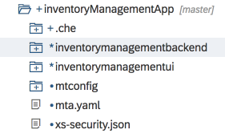


    * Server app file structure (…\inventorymanagementbackend):

        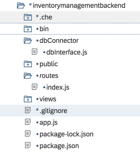


    * UI app file structure (…\inventorymanagementui):

        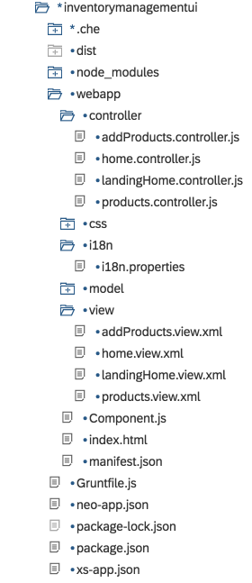


3. Now that you have cloned the repository, you need to build an MTAR:

    1. Locate the **inventoryManagementApp** project entry in the file structure.
    2. Right-click on the project entry and choose Build &rarr; Build
        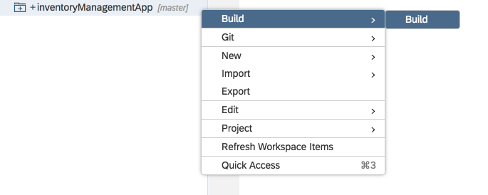


4. Once the build is completed, you should see a new folder created in your file explorer:

    


5. Now, right click on the newly created *.mtar* file and choose **Deploy** &rarr; **Deploy to SAP Cloud Platform**
    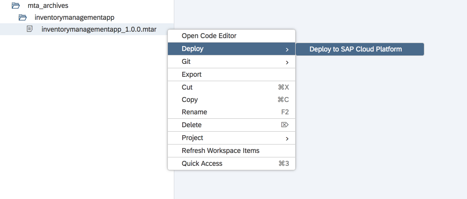


6. Enter in the SAP Cloud Platform, Cloud Foundry environment details where you want to deploy the application. The subaccount to which you deploy the application is referred to as the *provider subaccount.*
    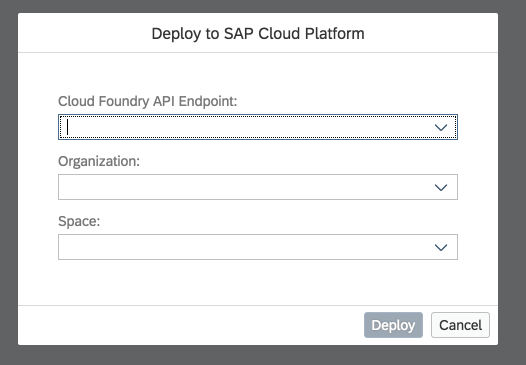

    The app deployment process starts. Once the app is deployed successfully, you'll see progress notifications on the top righthand corner.

    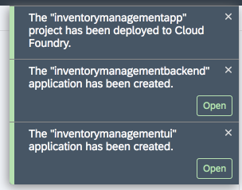


## Making the application available in the CF SaaS registry

In this section, we'll cover the steps that you need to do so that your application is registered and available in SAP Cloud Platform as a multitenant application. Your hosted application will then visible to other *consumer subaccounts* (tenants) and allow them to subscribe to it.

1. Using the project explorer in SAP Web IDE, go to config.json in the mtconfig folder.

    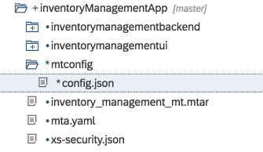


2. Make sure the file contains the following code:
    ```json
    {
        "appId": "<XS-App name goes here>",
        "displayName": "Inventory Management App",
        "description": "An app to manage your inventory",
        "category": "Provider XYZ",
        "appUrls": {
            "onSubscription": "https://<Your back-end app URL>/callback/v1.0/tenants/{tenantId}"
        }
    }
    ```
    We'll be filling in some of the necessary information in the next steps.

3.  Using the cf CLI, connect to your space in your Cloud Foundry landscape.

4.  View the environment variables of your application by executing the following command in the cf CLI:

    `cf env sample-saas-app`

5. Copy the value of **VCAP_SERVICES.xsuaa.credentials.xsappname** to the **<`XS-App name goes here`>** placeholder in your **mtconfig/config.json** file.

6.  In the **mtconfig/config.json** file, replace the **<`Your back-end app URL`>** placeholder with your backend app’s URL including the CF domain.

    The URL for your **onSubscription** parameter should now look something like this:

    `https://inventorymanagementbackend.<CF Domain>/callback/v1.0/tenants/{tenantId}`

7.  Using the project explorer, go to **index.js** in the **inventorymanagementbackend/routes** folder.
    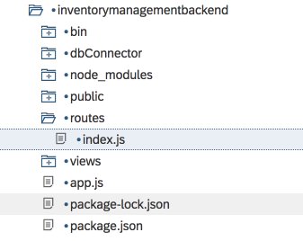


8.  Make sure the **index.js** file contains the following code:
    ```javascript
    router.put('/callback/v1.0/tenants/*', function (req, res) {
        var consumerSubdomain = req.body.subscribedSubdomain;
        var tenantAppURL = "https:\/\/" + consumerSubdomain + "-" + "<Your back-end app URL without the protocol>";
        res.status(200).send(tenantAppURL);
    });
    ```

9. In the **index.js** file, replace the **<`Your back-end app`>** placeholder with your backend app’s URL including the CF domain. **Do not include the HTTP/HTTPS protocol.**

    Your **tenantAppURL** parameter should now look something like this:

    `var tenantAppURL = "https:\/\/" + consumerSubdomain + "-inventorymanagementui.<CF Domain>";`

10. In some of the steps that follow, you'll be using the cf CLI tool. To execute these commands, navigate your terminal's working directory to **inventoryManagementApp**, where your **.yaml** file resides.

11. Create a new service instance of the SaaS registry by executing this command:

    ```
    mt-hw-app-lps-registry -c mtconfig/config.json
    ```

12. Bind the app to the SaaS registry service instance by executing this command:

    ```
    cf bs mt-hw-node-app mt-hw-app-lps-registry
    ```

13. Re-stage the app by executing this command:

    ```
    cf restage mt-hw-node-app
    ```

## Subscribe your consumer accounts to the deployed multitenant business application

1. Sign in to the SAP Cloud Platform.

2. Navigate to the global account where you deployed the sample multitenant business application.

3. Create a Cloud Foundry subaccount for the application consumer (tenant). There's no need to create a Cloud Foundry org and space.

4. Navigate to the new consumer subaccount and open the **Subscriptions** tab. You should see the **Inventory Management App** under the **Provider XYZ** category.

    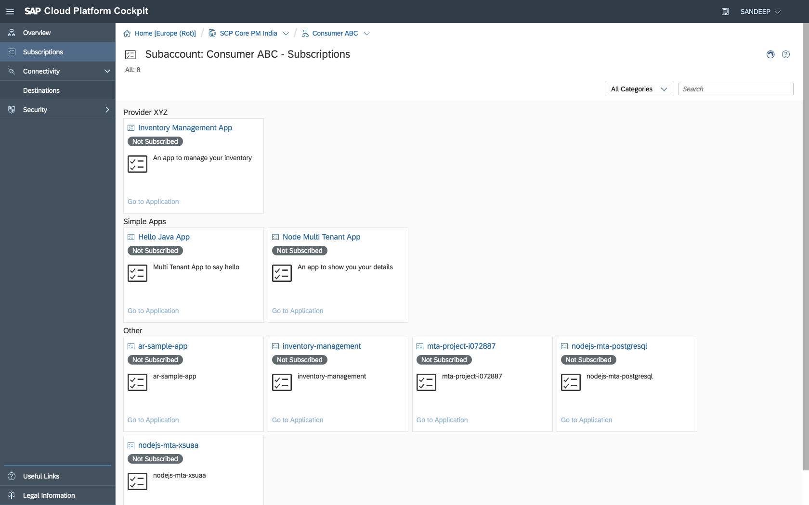


5.  Click on the **Inventory Management App** tile and then on the **Subscribe** button.
    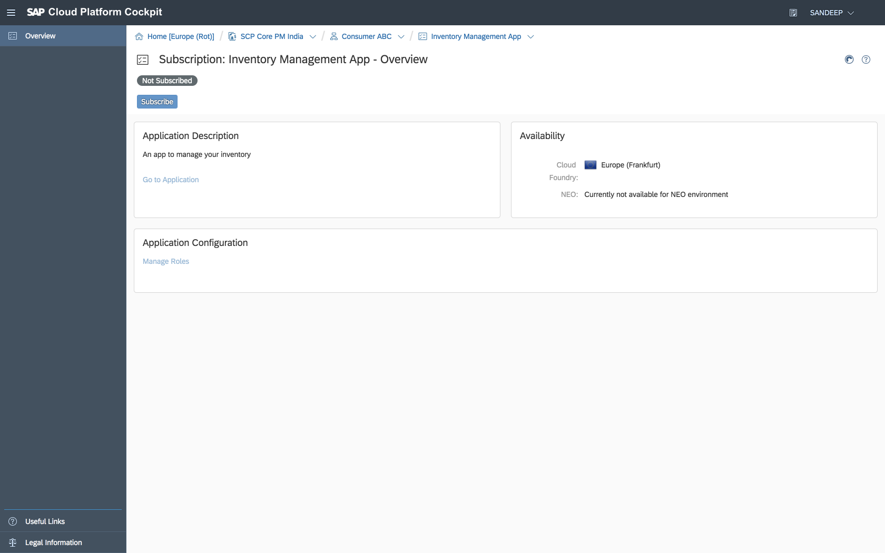


6.  Once the subscription process is completed, click on the **Go to Application** link to open the consumer app.
    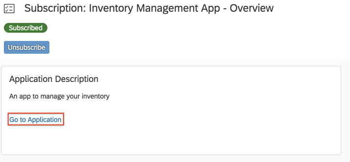


7. You can create additional consumer subaccounts and subscribe to the same sample multitenant business application.

   Add unique items to the product inventory in each consumer application and note that the stored information is isolated and secured per tenant.

## Additional Information
For detailed documentation about these steps, including guidelines for creating tenant-aware applications, refer to [Developing Multitenant Business Applications in the Cloud Foundry Environment](https://help.sap.com/viewer/65de2977205c403bbc107264b8eccf4b/Cloud/en-US/5e8a2b74e4f2442b8257c850ed912f48.html) on SAP Help Portal.